Plotting Hydra Data in URD
================
Jeff Farrell
May 21, 2019

Installing URD
==============

URD is a package written in R and designed to be used in the RStudio interactive environment. Instructions for its installation can be found here:

<https://github.com/farrellja/URD/blob/master/INSTALL.md>

Getting the Hydra data
======================

The analyses from Siebert *et al.* have been exported in the **.rds** format, ready to be read in to R. These files have all been uploaded to the Broad Single-cell Portal, and they can be downloaded from the following address (note, requires sign-in with a Google account). The files are available under the download tab, and all files beginning with **Hydra\_URD\_** or **Splines-** should be downloaded.

<https://portals.broadinstitute.org/single_cell/study/SCP260/stem-cell-differentiation-trajectories-in-hydra-resolved-at-single-cell-resolution>

Loading URD
===========

To begin, start RStudio, and then load the **URD** package with the `library` command:

``` r
# Load URD package!
library(URD)
```

Loading the Hydra Data
======================

Next, the exported analyses (in **.rds** format), must be loaded into memory using the `readRDS` command. There are URD objects (which contain tSNE projections for all tissues and contain trees for complex tissues) and also spline objects (which contain smoothed curves that represent gene expression along particular trajectories). The following code can be run to load all objects from the Hydra project into memory. It requires changing the `setwd` command to point to the directory where you have downloaded the data above.

``` r
# CHANGE THIS TO REFLECT THE PATH WHERE YOU SAVED THE HYDRA DATA!
setwd("~/Downloads/HydraURD/")

# Load URD objects with trees (i.e. branching trajectories)
interstitial <- readRDS("Hydra_URD_IC.rds")
ectoderm <- readRDS("Hydra_URD_Ectoderm.rds")
endoderm <- readRDS("Hydra_URD_Endoderm.rds")

# Load URD objects without trees (i.e. linear trajectories)
male <- readRDS("Hydra_URD_MaleTranscriptome.rds")
granular.zymogen <- readRDS("Hydra_URD_GranularZymogen.rds")
spumous <- readRDS("Hydra_URD_SpumousMucous.rds")

# Load spline curve fits for visualizing gene expression
ectoderm.splines <- readRDS("Splines-Ectoderm.rds")
endoderm.splines <- readRDS("Splines-Endoderm.rds")
male.splines <- readRDS("Splines-MaleTranscriptome.rds")
granular.zymogen.splines <- readRDS("Splines-GranularZymogen.rds")
spumous.splines <- readRDS("Splines-SpumousMucous.rds")
```

Finding a gene ID from an URD object
====================================

In the Hydra transcriptome that our RNAseq data is aligned against, each transcript has its own transcript identifier that begins "t\#\#\#\#\#aep". Putative gene identities have been assigned by BLASTing transcript sequences against the Swiss-Prot database, and their most significant alignment (including organism) has been appended to the transcript ID. To find transcripts by their alignment, the `grep` command can be used, which will return all transcripts whose alignment matched a particular name. In the following example, "FOXA2" can be replaced with another full or partial gene name.

``` r
grep("FOXA2", rownames(interstitial@logupx.data), value=T)
```

    ## [1] "t18735aep|FOXA2_ORYLA"

When multiple transcripts match a search, all IDs will be returned:

``` r
grep("SOX", rownames(interstitial@logupx.data), value=T)
```

    ##  [1] "t32032aep|SOX7_XENTR"  "t21322aep|SOX14_DANRE"
    ##  [3] "t25403aep|SOX14_XENTR" "t30122aep|SOX7_XENTR" 
    ##  [5] "t15393aep|SOX4_MOUSE"  "t24530aep|SOX3B_XENLA"
    ##  [7] "t23837aep|SOX2_CAEEL"  "t22224aep|SOX2_CHICK" 
    ##  [9] "t8955aep|SOX8_XENLA"   "t23172aep|SOX14_MOUSE"
    ## [11] "t4588aep|QSOX1_MOUSE"  "t12084aep|SOX14_MOUSE"

Additionally, this can be used to search by transcript ID (if matching a transcript from a figure in the paper or from a BLAST search, as below):

``` r
grep("t15393aep", rownames(interstitial@logupx.data), value=T)
```

    ## [1] "t15393aep|SOX4_MOUSE"

Lastly, if you have a sequence of interest, you can BLAST it against the Hydra transcriptome reference to find transcript IDs. (You will have to use the `grep` command above to identify its full entry in the URD objects.) To do so, go to <https://research.nhgri.nih.gov/hydra/sequenceserver/> and select the "Juliano aepLRv2" checkbox.

Plotting expression of genes on the URD tree
============================================

Plotting a single gene
----------------------

Gene expression can be plotted on URD tree objects using the command `plotTree`. For instance, to plot the gene "t2163aep", use the command below. Since genes are listed in the URD objects according to their gene ID and associated BLAST hit (if there was a good one), use the instructions described in **5. Finding a gene ID from an URD object** to identify the correct format for a gene name for plotting.

``` r
plotTree(interstitial, "t2163aep|COMA_CONMA")
```

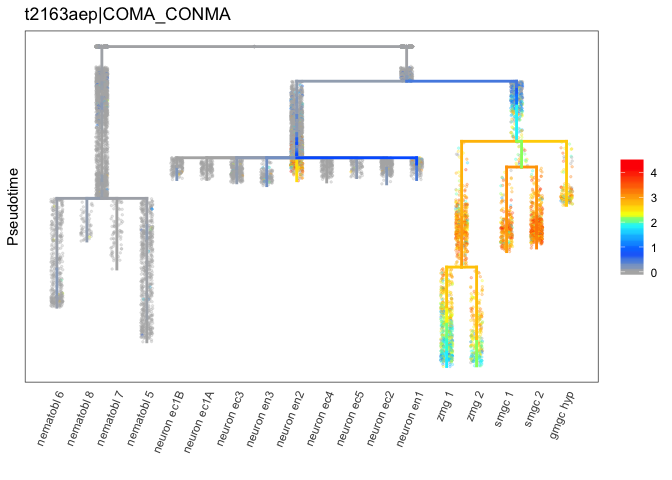

Plotting a single gene, discretized
-----------------------------------

Gene expression can be 'discretized' by comparing to a threshold and simply labeling which cells are above or below that threshold (i.e. positive or negative for expression of a gene). To do this, use the `plotTreeDiscretized` command. The parameters `label.min` and `label.max` vary the thresholds that are considered positive (i.e. all cells with an expression value between **label.min** and **label.max** are colored).

``` r
plotTreeDiscretized(interstitial, "t2163aep|COMA_CONMA", label.min=0.1, label.max=Inf)
```

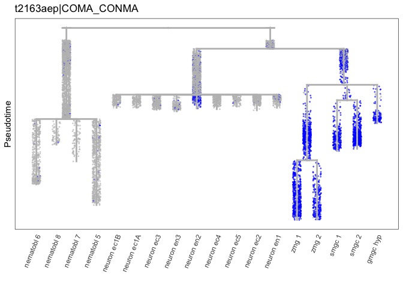

Plotting expression of multiple genes, continuous values
--------------------------------------------------------

The gene expression values for two genes can be plotted on the same tree to compare their expression, using a red-green color scheme; this is similar to a fluorescent micrograph, where cells with high expression of neither gene will be black, with high expression of a single gene will be red or green, and with high expression of both genes will be yellow. To make this type of plot, use the `plotTreeDual` command:

``` r
plotTreeDual(interstitial, "t2163aep|COMA_CONMA", "t12562aep|ASCL4_HUMAN")
```

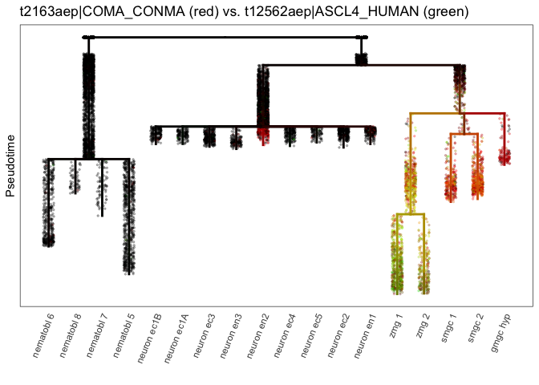

Plotting expression of multiple genes, discretized values
---------------------------------------------------------

Additionally, multiple genes can be plotted together in a discretized fashion using `plotTreeDiscretized`, showing cells that express neither gene (grey), both genes (red), or a single gene (blue/green). This is often easier to visually interpret than plotting expression of multiple genes in continuous values.

``` r
plotTreeDiscretized(interstitial, c("t8891aep|INX3_DROME", "t11055aep|LWA_HYDEC"), label.min = c(2.5, 2.5), label.max=c(Inf, Inf))
```

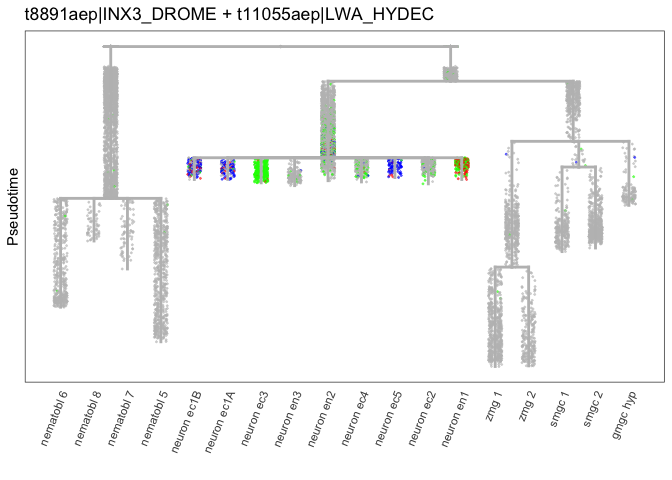

Plotting gene modules
---------------------

Additionally, the expression of NMF gene modules described in the manuscript can be visualized by substituting them for gene names in any of the `plotTree` commands.

``` r
plotTree(interstitial, "ic7")
```

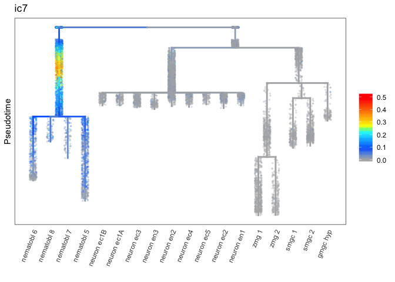

``` r
plotTreeDual(interstitial, "ic7", "ic49")
```

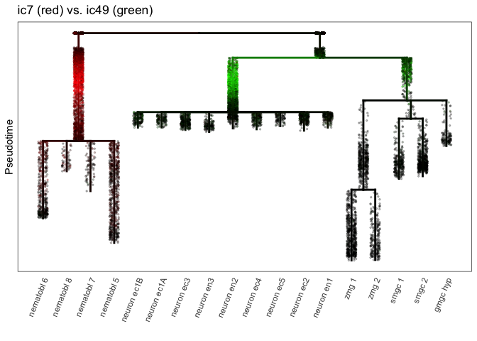

The full collection of modules available can be retrieved using this command:

``` r
colnames(interstitial@nmf.c1)
```

    ##  [1] "ic4"  "ic6"  "ic7"  "ic8"  "ic10" "ic12" "ic13" "ic14" "ic16" "ic17"
    ## [11] "ic18" "ic19" "ic22" "ic23" "ic24" "ic25" "ic27" "ic28" "ic29" "ic30"
    ## [21] "ic31" "ic33" "ic34" "ic35" "ic36" "ic37" "ic38" "ic39" "ic40" "ic42"
    ## [31] "ic43" "ic44" "ic45" "ic46" "ic48" "ic49" "ic50" "ic51" "ic52" "ic53"
    ## [41] "ic54" "ic55" "ic57" "ic58" "ic61" "ic63" "ic64" "ic65" "ic68" "ic70"
    ## [51] "ic71"

Other tissues
-------------

The most interesting URD tree is for the interstitial lineage, as it is the most complex. However, simple trees also exist for the **endoderm** and **ectoderm** and can be plotted by replacing **interstitial** with the appropriate tissue in the above commands.

Plotting expression of genes on spline curves
=============================================

For some of the developmental trajectories, we have calculated splines that help visualize the expression of genes along developmental (male germline) or spatial trajectories (ectoderm, endoderm, granular/zymogen mucous, spumous mucous). Some trajectories are comprised of multiple segments (ectoderm, endoderm), whereas others are single segments (male germline, granular/zymogen mucous, spumous mucous), and these have separate plotting functions as described below.

Single segment splines
----------------------

The `plotSmoothFit` function is appropriate for use with the **male.splines**, **spumous.splines**, and **granular.zymogen.splines** objects.

``` r
plotSmoothFit(granular.zymogen.splines, "t22116aep|ETV1_MOUSE")
```

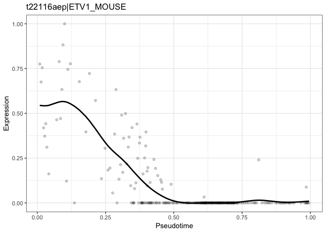

It can also be provided with a vector of genes to generate either a plot with several curves in different colors, or a panelled plot of single genes (configured using the **multiplot** parameter, as shown below).

``` r
plotSmoothFit(granular.zymogen.splines, c("t34999aep|SRBP1_PIG", "t22116aep|ETV1_MOUSE", "t5528aep|SX21B_DANRE", "t20911aep|UNC4_CAEEL"))
```

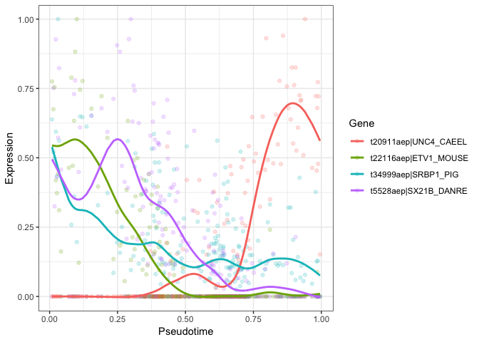

``` r
plotSmoothFit(granular.zymogen.splines, c("t34999aep|SRBP1_PIG", "t22116aep|ETV1_MOUSE", "t5528aep|SX21B_DANRE", "t20911aep|UNC4_CAEEL"), multiplot=T)
```

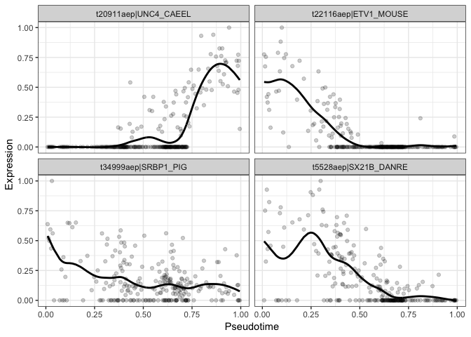

Multi-segment splines
---------------------

The `plotSmoothFitMultiCascade` function is appropriate for use with the **ectoderm.splines** and **endoderm.splines** objects. It can accept either a single gene, or a vector of genes, which will produce a multi-panelled plot.

``` r
plotSmoothFitMultiCascade(endoderm.splines, "t35005aep|CHRD_XENLA")
```

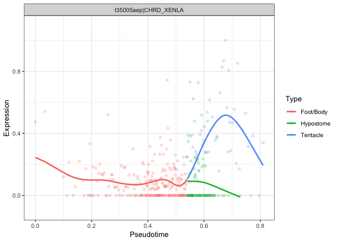

``` r
plotSmoothFitMultiCascade(ectoderm.splines, c("t11061aep|APCD1_CHICK", "t35005aep|CHRD_XENLA", "t2948aep|EGL4_CAEEL"), ncol = 1)
```

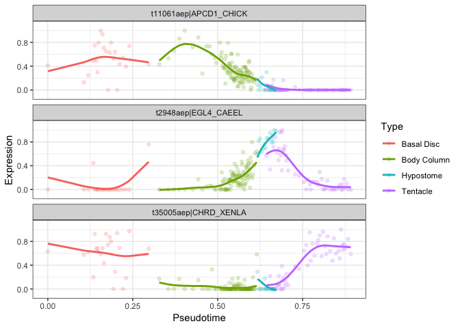

Going farther
=============

Further configuring your plots
------------------------------

Many parameters of the plots are easily configurable, including their titles, the colors (and color schemes) used, the size and transparency of points, the layout of panels in multi-panel layouts, and they style or presence of legends. To learn more about any given function, type it into the console with a ? before it (i.e. `?plotTree`). This should open the documentation for that function, which includes a listing of all of its potentially configured parameters.

The full supplementary analysis
-------------------------------

For more information about how to use or interact with the URD objects, every command that was used to generate any figure in Siebert *et. al* is described in our full supplementary analysis. This includes all commands used to construct the URD objects that you have downloaded (and so would allow you to vary parameters used in these analyses), as well as all commands used to query them in more complex ways: differential expression, construction of heatmaps, and the like. That analysis can be found here: <https://github.com/cejuliano/hydra_single_cell>

Additionally, supplementary analyses from URD used in other work are available, which provide insight into additional ways that the data can potentially be analysed. These are available here: <https://github.com/farrellja/URD/tree/master/Analyses>

The full URD documentation
--------------------------

Also, functions in the URD package are documented! `?URD` will open a "getting started" list of functions used for doing basic analyses with additional plotting functions available at the bottom. Furthermore, at the bottom is a link to the Index, which links to the documentation of every command available in the package.

Troubleshooting
===============

Error in data.for.plot ... Cannot find ...
------------------------------------------

`Error in data.for.plot(object, label = label, label.type = label.type,  :` `Cannot find ### in metadata, group.ids, signatures, genes, NMF modules, PCA, or pseudotime.`

This error message means that the `plotTree` command cannot find the gene or module name you provided. In general, this means you should check the ID and name of your gene (see **5. Finding a gene ID from an URD object**).

Must provide an URD object as input to plotTree
-----------------------------------------------

`Error in plotTree(###, ###) :` `Must provide an URD object as input to plotTree.`

This error will occur if trying to provide a spline object to the `plotTree` command. See **7. Plotting expression of genes on spline curves** to plot from a spline curve.

A tree has not been calculated for this URD object
--------------------------------------------------

`Error in plotTree(###, ###) :` `Must provide an URD object as input to plotTree.`

This error will occur if you provide a linear trajectory (which does not actually have a tree structure calculated) to the `plotTree` command. `plotTree` can only be used with **interstitial**, **endoderm**, or **ectoderm**.

You have provided a multi-segment spline ...
--------------------------------------------

`Error in plotSmoothFit(###, ###) :` `You have provided a multi-segment spline,` `which should be plotted with the function plotSmoothFitMultiCascade.`

This will occur if you provide a mulit-segment spline (**endoderm.splines** or **ectoderm.splines**) to `plotSmoothFit`. Instead use `plotSmoothFitMultiCascade` (see **7.2 Multi-segment splines**).

plotSmoothFit requires a spline object ...
------------------------------------------

`Error in plotSmoothFit(###, ###) :` `plotSmoothFit requires a spline object; you have provided an URD object.`

This will occur if you provide an URD tree object to `plotSmoothFit`. `plotSmoothFit` can plot from **male.splines**, **spumous.splines**, or **granular.zymogen.splines**.

plotSmoothFitMultiCascade requires a list ...
---------------------------------------------

`Error in plotSmoothFitMultiCascade(###, ###) :` `plotSmoothFitMultiCascade requires a list of spline objects;` `you have provided an URD object.`

This will occur if you provide an URD tree object to `plotSmoothFitMultiCascade`. `plotSmoothFitMultiCascade` can plot from **ectoderm.splines** or **endoderm.splines**.

You have provided the output of geneSmoothFit ...
-------------------------------------------------

`Error in plotSmoothFitMultiCascade(###, ###) :` `You have provided the output of geneSmoothFit,` `which should be plotted with the function plotSmoothFit.` `plotSmoothFitMultiCascade should be provided a list of outputs from` `geneSmoothFit, with list names set to the names desired for fit segments.`

This will occur if you provide a single-segment spline (**granular.zymogen.splines**, **male.splines**, or **spumous.splines**) to `plotSmoothFitMultiCascade`. Use `plotSmoothFit` instead (see **7.1 Single segment splines**).
